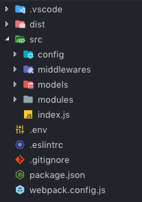
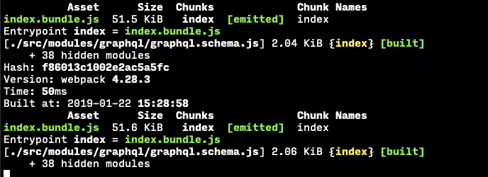

많이쓰는 node express mongodb 조합으로 회원가입과 github인증등을 구현. 첫번째로는 프로젝트의 구조등을 설정함.

### 구조



위 구조에서 지금 당장은 models폴더가 필요하지 않다.

---

### 필요한 패키지 설치

`yarn add express mongoose dotenv`

> 필요에따라 webpack과 nodemon도 global설치하자

---

### webpack.config.js 설정

```javascript
const path = require('path');
const nodeExternals = require('webpack-node-externals');

module.exports = {
  entry: {
    index: './src/index.js',
  },
  output: {
    path: path.join(__dirname, 'dist'),
    publicPath: '/',
    filename: '[name].bundle.js',
  },
  target: 'node',
  externals: [nodeExternals()], // Need this to avoid error when working with Express
  module: {
    rules: [
      {
        // Transpiles ES6-8 into ES5
        test: /\.js$/,
        exclude: /node_modules/,
        use: {
          loader: 'babel-loader',
        },
      },
    ],
  },
};
```

---

### 앱의 진입점을 src/index.js로 했으니 작성

```javascript
import express from 'express';

import './config/db';

import constants from './config/constants';
import middlewares from './middlewares';
import appRoutes from './modules';

const app = express();

middlewares(app);
appRoutes(app);

app.get('/', (req, res) => {
  return res.status(200).json({ hey: 'man' });
});

app.listen(constants.PORT, err => {
  if (err) {
    throw err;
  }

  console.log(`server is running on port ${constants.PORT}`);
  console.log(`running environment is ${process.env.NODE_ENV}`);
});
```

---

`config`폴더내의 `db.js`와 `constants.js`가 필요하니까 작성해야한다. db는 mongoose를 사용해서 mongodb를 구동하고 constants는 mongodb와 api에 사용하는 상수들을 객체로 가져온다

### index에서 필요한 config폴더의 db.js와 constants.js작성

```javascript
import mongoose from 'mongoose';

import constants from './constants';

if (process.env.NODE_ENV !== 'production') {
  mongoose.set('debug', true);
}

const options = {
  useNewUrlParser: true,
  useCreateIndex: true,
  dbName: constants.DB_NAME,
  autoReconnect: true,
  reconnectTries: 30,
};

mongoose
  .connect(
    constants.DB_URL,
    options
  )
  .then(() => console.log('mongoDB is running...'))
  .catch(err => console.error(err));
```

```javascript
import dotenv from 'dotenv';

dotenv.config();

const config = {
  development: {
    DB_URL: process.env.DB_URL,
    DB_NAME: 'newbie-dev',
    JWT_SECRET: process.env.JWT_SECRET,
  },
  production: {
    DB_URL: process.env.DB_URL,
    DB_NAME: 'newbie-prod',
    JWT_SECRET: process.env.JWT_SECRET,
  },
  test: {
    DB_URL: process.env.DB_URL,
    DB_NAME: 'newbie-test',
    JWT_SECRET: process.env.JWT_SECRET,
  },
};

const getConfig = env => config[env];

const defaultConfig = {
  PORT: process.env.PORT,
};

export default {
  ...defaultConfig,
  ...getConfig(process.env.NODE_ENV),
};
```

---

### 미들웨어구현

```javascript
import express from 'express';
import morgan from 'morgan';
import compression from 'compression';
import helmet from 'helmet';
import passport from 'passport';
import redis from 'redis';
import cors from 'cors';

const isDev = process.env.NODE_ENV === 'development';
const isProd = process.env.NODE_ENV === 'production';
const client = redis.createClient(6379, '127.0.0.1');

export default app => {
  if (isProd) {
    app.use(compression());
    app.use(helmet());
  }

  app.use(cors());

  app.use(express.json());

  app.use(passport.initialize());

  app.use((req, res, next) => {
    req.cache = client;
    next();
  });

  if (isDev) {
    app.use(morgan('dev'));
  }
};
```

> 패키지 설치한게 많은데 필요없는건 설치 안해도된다. 그리고 앱 루트폴더에 `.env`파일을 만들어 적절하게 필요한 값을 입력한다.

---

### 실행과 결과

이제 앱에서 지금은 필요없는 `appRoutes(app);`같은것들을 주석으로 막고 실행해보면 실행이 된다. 빌드하기위해선 콘솔에서 `webpack -w --mode development`. 실행은 `nodemon ./dist/index.bundle.js`하면 되는데 계속 이렇게 할 순 없으니 `package.json`파일에서 적절하게 스크립트를 작성하고 실행하면 아래와같이 나와야한다.




**continue...**
