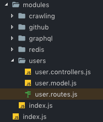
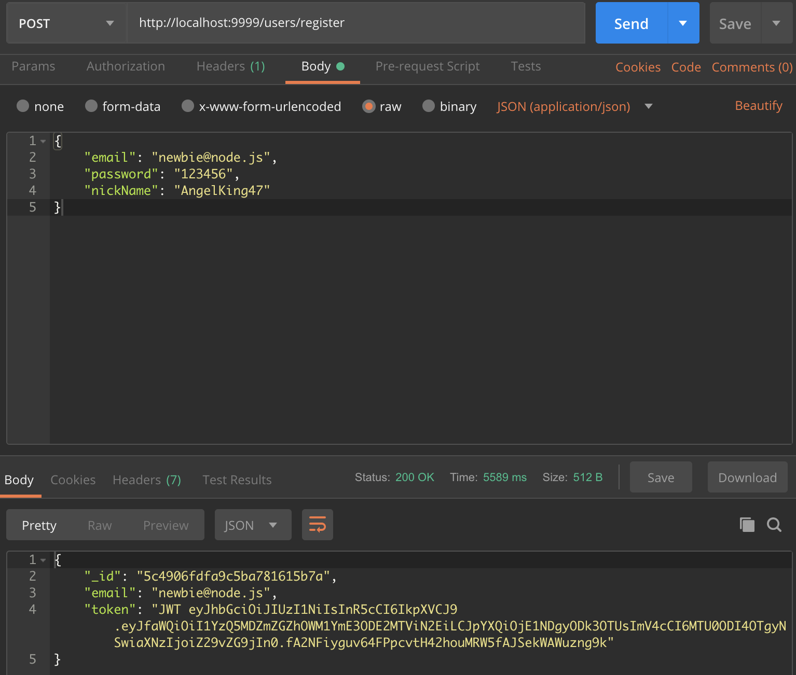
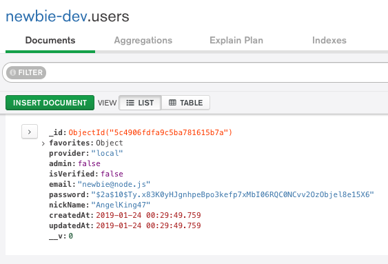

이전글에 이어서 모델도 만들어보고 라우팅도 해보고 잘 되나 확인해보자. 하는김에 이메일 인증도?

회원가입과 로그인 둘다 post방식이고 엔드포인트는 `/user/register`, `/user/login`으로 한다. 앱구조는 편한대로하면 되지만 여기선 아래의 구조를 따른다. 어디선가 많이 보던 방식이다. `src`폴더에 `modules`폴더를 만들고 그 안에서 놀자



> api통신은 각자 편한걸로 하면 된다. 몽고디비 기본 GUI인 compass도 설치하면 좋음. 코드 대부분 `import`는 삭제함

---

### 모델

```javascript
const User = new Schema(
  {
    email: {
      type: String,
      required: [true, 'Email is required!!'],
      trim: true,
      unique: true,
    },
    password: {
      type: String,
      minlength: [6, 'Password need to be longer'],
    },
    nickName: {
      type: String,
      trim: true,
    },
    provider: {
      type: String,
      default: 'local',
    },
    admin: {
      type: Boolean,
      default: false,
      required: false,
    },
    isVerified: {
      type: Boolean,
      default: false,
    },
    favorites: {
      posts: [
        {
          type: Schema.Types.ObjectId,
          ref: 'Post',
        },
      ],
    },
  },
  {
    timestamps: true,
  }
);

User.pre('save', function(next) {
  if (this.isModified('password')) {
    this.password = hashSync(this.password);
  }

  return next();
});

User.methods = {
  _compareUser(password) {
    /**
     * FIXME:
     * github으로 가입한사람은 패스워드가 없기때문에 비교할수 없음
     */
    if (this.password === undefined) {
      return;
    }
    return compareSync(password, this.password);
  },

  _createToken() {
    return jwt.sign(
      {
        _id: this._id,
      },
      constants.JWT_SECRET,
      {
        expiresIn: '30s',
        issuer: 'angelking47',
      }
    );
  },

  toAuthJSON() {
    return {
      _id: this._id,
      email: this.email,
      token: `JWT ${this._createToken()}`,
    };
  },
};

export default mongoose.model('User', User);
```

`jwt`, `bcrypt-nodejs`모듈도 어차피 나중에 다 쓴다. 피가되고 살이되니까 설치하자.

적절히 유저모델을 정의하고 필요한 함수들도 만들어준다. 로그인을하면 response로 `toAuthJSON()`을 호출할꺼다. `compareUser`는 미들웨어로 `passport-local`를 사용해서 기본로그인할때 로그인시 받아온 비밀번호와 이메일로 찾은 유저의 비밀번호를 매칭해서 동일하면 `유저`를, 다르면 `false`를 리턴한다. `createToken`은 호출할때마나 jwon web token만들어줌. 테스트를 위해 만료는 30초로함.

> `User.pre('save', callback)`은 모델 **저장전**에 발생하며 이메일로 찾은 유저는 `User.findOne({ email })`이다. provider는 외부인증로그인을 구현할때 필요

---

### 컨트롤러

```javascript
export const register = async (req, res) => {
  try {
    const { email } = req.body;
    const duplicateEmail = await User.findOne({ email });

    if (duplicateEmail) {
      throw new Error('user is already exist');
    } else {
      const user = await User.create(req.body);
      const token = await Token.create({
        _userId: user._id,
        token: crypto.randomBytes(16).toString('hex'),
      });

      const transporter = nodemailer.createTransport({
        host: 'smtp.ethereal.email',
        port: 587,
        auth: {
          user: 'wvu44xkoolzo6loj@ethereal.email',
          pass: 'HY4fyMB2SGG8WyKrQc',
        },
      });

      const mailOptions = {
        from: 'no-reply@ethereal.email',
        to: 'urdlove@gmail.com',
        subject: '행운의편지...',
        text: `http://${req.headers.host}/users/confirm/${token.token}\n\nEmail: ${user.email}`,
      };

      transporter.sendMail(mailOptions, (err, info) => {
        if (err) {
          return res.status(500).send({ msg: err.message });
        }

        return res.status(200).json(user.toAuthJSON());
      });
    }
  } catch (error) {
    return res.status(400).json(error.message);
  }
};
```

코드에 회원가입시 인증메일까지 보내는 절차까지 있는데 해당하는부분은 무시하고 진행해도 회원가입은 된다. TMI로 토큰만들때 사용하는 `crypto`모듈은 현재 노드버전에 내장되어있다.

1. 회원가입요청하면 토큰모델을 바탕으로 토큰을 만들고(만료시간뒤에 데이터가 사라짐)
2. 해당토큰을 메일로 쏴준다.
3. 받은메일로 `/users/confirm/:token`에 접근
4. params의 token과 DB의 토큰을 비교해서 맞으면 유저의 isVerified를 true로 바꿔줌(토큰모델에 user.\_id가 있음)

---

### 라우팅

```javascript
import { Router } from 'express';

import { authLocal } from '../../middlewares/auth';
import * as userController from './user.controllers';

const routes = new Router();

routes.post('/register', userController.register);

routes.post('/login', authLocal, userController.login);

export default routes;
```

가입하는 엔드포인트만 보면 express의 Router를 가져와서 post방식으로 `/register`에 접근하면 해당컨트롤러를 실행하게된다. 파라메터는 미들웨어를 포함해서 여러개일수가 있다.

이제 이전에 만들어놓은 앱실행파일인 `index.js`에 `appRouter(app)`를 작성하고 라우팅 미들웨어를 만들면 된다.

```javascript
export default app => {
  app.use('/crawling', crawlingRoutes);
  app.use('/redis', redisRoutes);
  app.use('/users', userRoutes);
  app.use('/auth', githubRoutes);
  app.use('/graphql', graphqlMiddleware);
};
```

여러개가 있는데 `/users`로 접근하는건 `userRoutes`로 보내고 결국엔 `/users/register`형식이 된다.

---

### 실행과 결과

적당히 만들었으니 포스트맨으로 가입요청을 하고 response를 확인하고, mongoDB compass로 db에 잘 저장이 되었는지 확인하자.





JWT도 잘 담아서 보내고 비밀번호도 hash해서 저장이 잘 됐다.

---

### 마무리

노드실행환경은 8.12.0이고 다른버전들 설치하려면 `nvm`설치해서 하면된다. 이메일 인증은 [Nodemailer](https://nodemailer.com/about/)가 getting started에서 사용하는 [ethereal](https://ethereal.email/)으로 함

회원가입을 했으니 다음은 로그인을 해보자...
