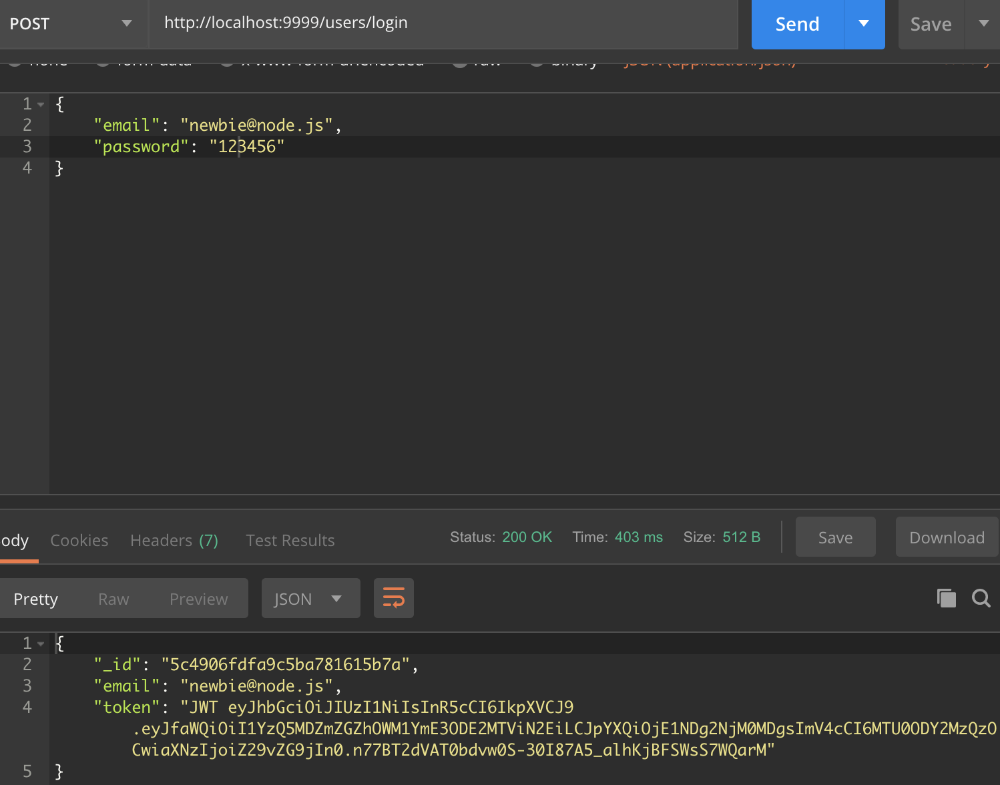

회원가입까지 잘 끝냈으면 마지막은 로그인이다. 로그인은 이미 대부분 필요한건 끝내놨기 때문에 별거 없다. 로그인 라우터부터 작성해보자.

### 라우터

```javascript
routes.post('/login', authLocal, userController.login);
```

`/login`은 `authLocal`미들웨어를 거친 후 응답을 한다.

---

### 미들웨어

```javascript
const localOptions = {
  usernameField: 'email',
};

const localStrategy = new LocalStrategy(localOptions, async (email, password, done) => {
  try {
    const user = await User.findOne({ email });

    if (!user) {
      return done(null, false);
    }

    if (!user._compareUser(password)) {
      return done(null, false);
    }

    if (!user.isVerified) {
      return done(null, false);
    }

    return done(null, user);
  } catch (error) {
    return done(error, false);
  }
});

passport.use(localStrategy);

export const authLocal = passport.authenticate('local', { session: false });
```

로그인 유저네임필드를 `email`로 옵션설정하고 유저객체를 가져와서 검증하는 미들웨어작성.

- 유저가 없으면 실패
- 비밀번호가 다르면 실패
- `isVerified`가 `false`면 실패 (이메일 인증에서 true로 바꿔줌)
- 다 통과하면 성공

---

### 컨트롤러

```javascript
export const login = async (req, res) => {
  return res.status(200).json(req.user.toAuthJSON());
};
```

미들웨어에서 검증하는단계를 거치고 성공하면 `user`객체를 리턴해줬기때문에 `req.user`로 접근가능하다. `toAuthJSON`은 모델에서 이미 만들어놓은 함수

---

### 실행과 결과


