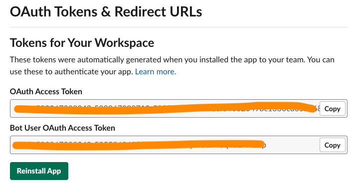
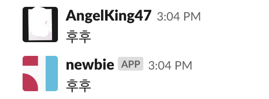

갓갓 협업툴인 [슬랙](https://slack.com)으로 매우 간단한 봇을 만들어보자. 그냥 단순히 내가 말하는거 따라하는거다 별거없다.

> es6문법을 사용하기때문에 적절히 `babel`설정을 하자

---

### Create app & Token 발급

1. [슬랙에서 사용할 third-pary app을 만들자](https://api.slack.com/)

2. `OAuth & permissions`메뉴의 `Scopes`탭에서 적절히 권한을 설정한다.



적절히 발급받은 토큰을 바탕으로 `install App` ㄱㄱ

---

### 코드작성

[Node-Slack-SDK](https://slackapi.github.io/node-slack-sdk/)를 바탕으로 적절한 라이브러리를 설치한다.

```javascript
import dotenv from 'dotenv';
import { WebClient, RTMClient } from '@slack/client';

dotenv.config();

const rtm = new RTMClient(process.env.SLACK_BOT_TOKEN);

rtm.start();

rtm.on('message', message => {
  console.log(`(channel:${message.channel}) ${message.user} says: ${message.text}`);
  rtm.sendMessage(message.text, message.channel);
});
```

`message`이벤트를 감지하면 내가 보낸 메세지를 다시 채널에 뿌려주는 갓갓어플리케이션이다.

---

### 결과


